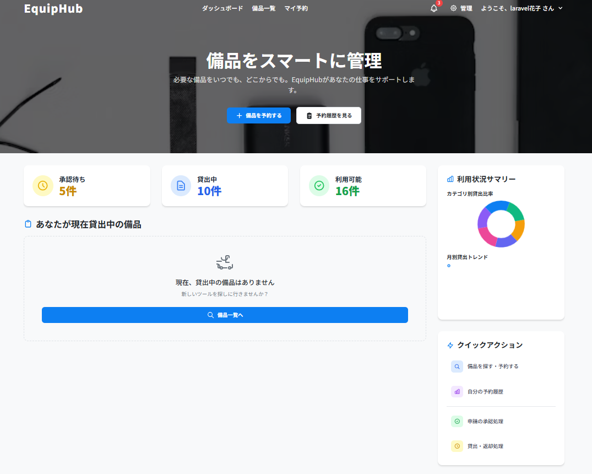
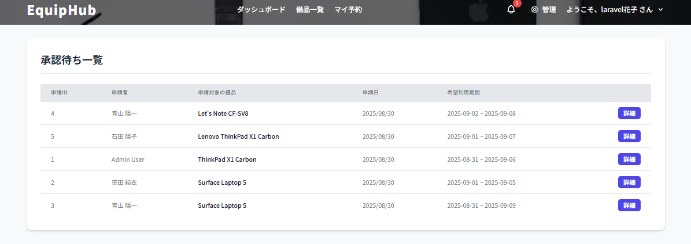
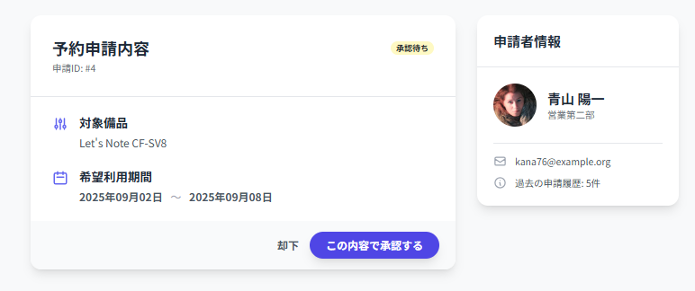
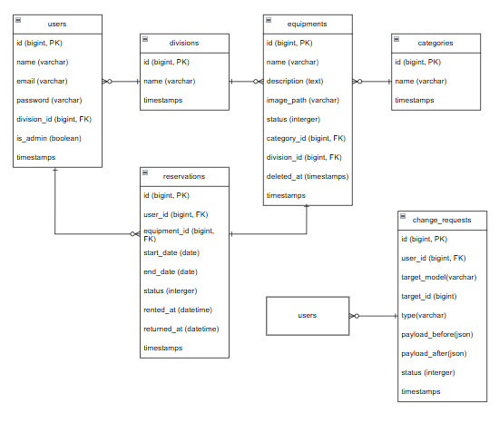

# EquipHub - チームのための、スマート・ポータル
## 1. コンセプト

「実務で、明日からでも使える」をテーマにした、堅牢で、直感的で、そして拡張し続ける、チームのための統合業務プラットフォームです。

本アプリケーションは、単一の業務（備品管理）を解決するだけでなく、組織内に散在する様々な申請・予約・情報共有といったプロセスを、一つの美しいインターフェースに統合することを目指します。
このポートフォリオでは、その第一弾として**「備品管理機能」と、その根幹をなす「汎用承認ワークフロー」**を実装しました。

---

## 2. 主な機能一覧

### 認証機能
- Laravel Breezeをベースにした、安全なログイン、新規登録、パスワードリセット機能。

### 動的なダッシュボード
- ログインユーザーの権限に応じて、表示内容が変化します。
- **管理者:** カテゴリ別備品数や月別貸出トレンドなどをChart.jsで動的にグラフ表示。
- **一般ユーザー:** 自身が現在貸出中の備品や、申請状況を一覧で確認可能。
- 役割に応じた「クイックアクション」メニューにより、主要機能へワンクリックでアクセスできます。



### 備品管理 (CRUD)
- 管理者は、備品の新規登録、一覧、編集、削除（論理削除）を行えます。
- 画像のアップロードにも対応しています。

### 汎用承認ワークフロー
- ユーザーは、備品と期間を選択し、予約の「申請」を行うことができます。
- 管理者は、申請された内容を一覧で確認し、「承認」または「却下」することができます。
- 申請結果は、Mailpitを利用して、申請者にメールで自動的に通知されます。




### 貸出・返却管理
- 管理者は、承認済みの予約に対して「貸出実行」処理を行えます。
- 貸出中の備品に対して「返却処理」を行うことで、備品のステータスが自動的に「利用可」に戻ります。
- これにより、備品の予約から返却まで、一貫したライフサイクル管理を実現しています。

---

## 3. こだわりの設計（技術的アピールポイント）

### ① 進化する、究極の汎用承認フロー
当初は、申請と承認アクションを別々のテーブルで管理する設計も検討しました。しかし、よりシンプルで、かつ十分な表現力を持つアーキテクチャを追求した結果、`change_requests`テーブルに`status`カラムを持たせ、状態遷移（ステートマシン）としてワークフローを管理する、現在の形へとたどり着きました。

`target_model`と`target_id`による**ポリモーフィックリレーション**を採用しているため、将来的に「会議室予約」や「経費申請」といった全く異なる業務を追加する際にも、データベース構造を変更することなく、同じ承認基盤を完全に再利用できます。

### ② 品質をコードで保証する、テスト駆動開発 (TDD)
「ただ動く」だけでなく、「正しく動き続ける」ことを保証するため、自動テストを徹底的に実装しました。

- **Featureテスト:** ユーザーの操作を模倣し、主要機能が正しく連携して動作することを検証。
  - **認可:** 一般ユーザーが管理者ページにアクセスできないこと、管理者専用の操作を実行できないことを証明。
  - **バリデーション:** 不正なデータ（期間の重複など）による申請を、正しくブロックすることを証明。
  - **CRUD:** 管理者による、データの登録・更新・削除が、意図通りに実行されることを証明。
- **Unitテスト:** モデルのアクセサなど、最小単位の機能が、仕様通りに完璧に動作することを証明。


### ③ モダンな開発環境
- **Docker / Laravel Sail:** 開発環境を完全にコンテナ化し、OSに依存しない、再現性の高い開発を実現。
- **Vite:** 高速なHMR（ホットモジュールリプレイスメント）により、快適なフロントエンド開発を実現。

---

## 4. 使用技術一覧

- **バックエンド:** PHP 8.4, Laravel 12
- **フロントエンド:** HTML, Tailwind CSS, JavaScript, Alpine.js, Chart.js
- **データベース:** MySQL
- **開発環境:** Docker, Laravel Sail, Vite
- **テスト:** PHPUnit
- **その他:** Git, GitHub, Mailpit

---

## 5. ER図


---

## 6. 環境構築・起動方法

1.  リポジトリをクローン
    ```bash
    git clone https://github.com/miharuaraki0131/equip-hub.git
    cd equip-hub
    ```
2.  `.env`ファイルの準備
    ```bash
    cp .env.example .env
    ```
3.  Dockerコンテナの起動
    ```bash
    ./vendor/bin/sail up -d
    ```
4.  各種パッケージのインストールと設定
    ```bash
    ./vendor/bin/sail composer install
    ./vendor/bin/sail artisan key:generate
    ./vendor/bin/sail artisan migrate --seed
    ./vendor/bin/sail npm install
    ./vendor/bin/sail npm run dev
    ```
5.  アプリケーションにアクセス
    - [http://localhost](http://localhost)

### テスト用アカウント
`database/seeders/DatabaseSeeder.php` によって、以下の2人のユーザーが作成されます。

- **管理者ユーザー**
  - **Email:** `admin@example.com`
  - **Password:** `password`
- **一般ユーザー**
  - **Email:** `user@example.com`
  - **Password:** `password`
